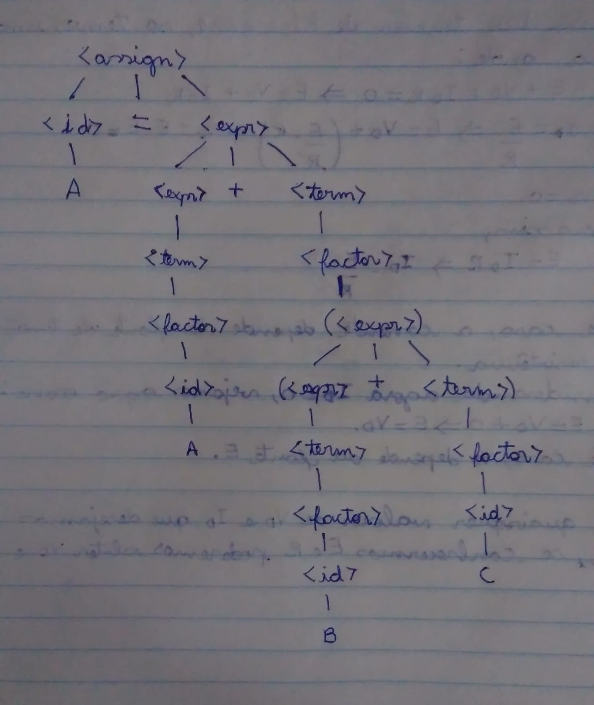
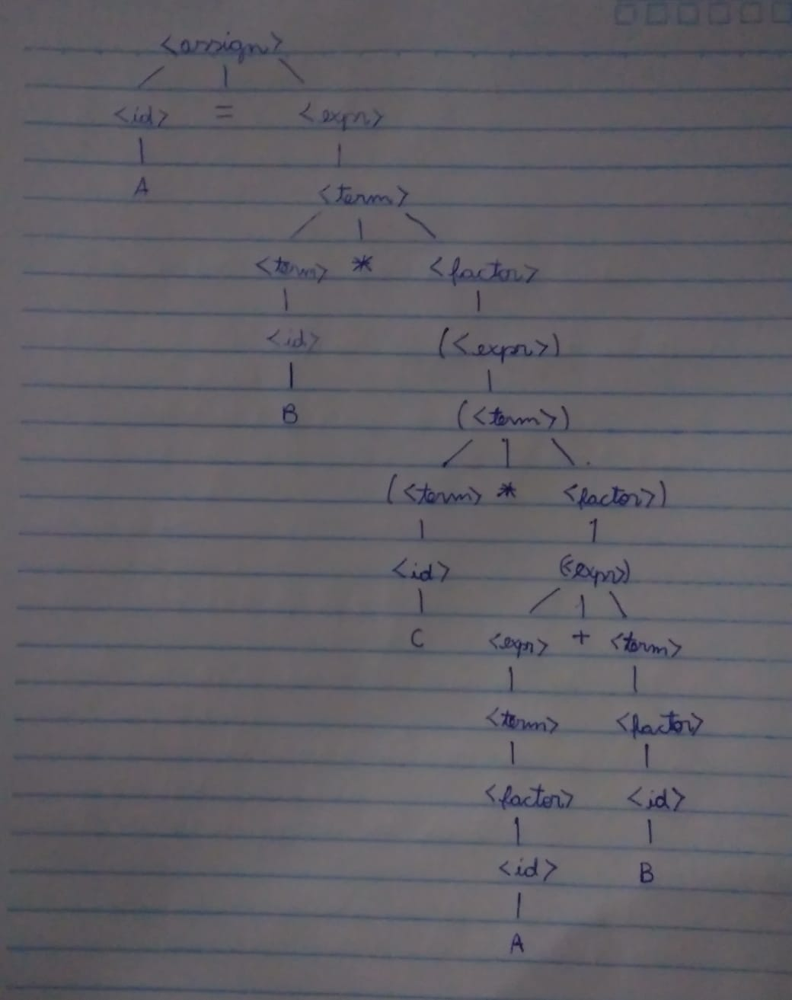

# Nome: João Pedro

### Questão 01

 - 1. Derivação a esquerda. A = A + (B + C) 

```
<assign> => <id> = <expr>
         => A = <expr>
         => A = <expr> + <term>
         => A = <term> + <term>
         => A = <factor> + <term>
         => A = <id> + <term>
         => A = A + <term>
         => A = A + <factor>
         => A = A + (<expr>)
         => A = A + (<expr> + <term>)
         => A = A + (<term> + <term>)
         => A = A + (<factor> + <term>)
         => A = A + (<id> + <term>)
         => A = A + (B + <term>)
         => A = A + (B + <factor>)
         => A = A + (B + <id>)
         => A = A + (B + C)
```


 - 2. Derivação a direita. A = B * (C * (A + B))

```
<assign> => <id> = <expr>
         => A = <expr>
         => A = <term>
         => A = <term> * <factor>
         => A = <id> * <factor>
         => A = B * <factor>
         => A = B * (<expr>)
         => A = B * (<term>)
         => A = B * (<term> * <factor>)
         => A = B * (<id> * <factor>)
         => A = B * (C * <factor>)
         => A = B * (C * (<expr>))
         => A = B * (C * (<expr> + <term>))
         => A = B * (C * (<term> + <term>))
         => A = B * (C * (<factor> + <term>))
         => A = B * (C * (<id> + <term>))
         => A = B * (C * (A + <term>))
         => A = B * (C * (A + <factor>))
         => A = B * (C * (A + <id>))
         => A = B * (C * (A + B))
```


### Questão 02

Derivação a direita. (a 23 (m x y))

```
<lexp> => <lista> 
       => (<lexp-seq>)
       => (<lexp-seq> <lexp>)
       => (<lexp-seq> <lista>)
       => (<lexp-seq> (<lexp-seq>))
       => (<lexp-seq> (<lexp-seq> <lexp>))
       => (<lexp-seq> (<lexp-seq> <átomo>))
       => (<lexp-seq> (<lexp-seq> y))
       => (<lexp-seq> (<lexp-seq> <lexp> y))
       => (<lexp-seq> (<lexp-seq> <átomo> y))
       => (<lexp-seq> (<lexp-seq> x y))
       => (<lexp-seq> (<lexp> x y))
       => (<lexp-seq> (<átomo> x y))
       => (<lexp-seq> (m x y))
       => (<lexp-seq> <lexp> (m x y))
       => (<lexp-seq> <átomo> (m x y))
       => (<lexp-seq> 23 (m x y))
       => (<lexp> 23 (m x y))
       => (<átomo> 23 (m x y))
       => (a 23 (m x y))
```