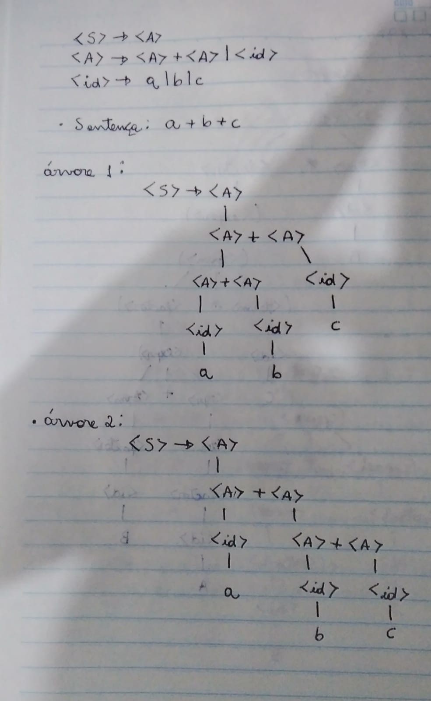

# Nome: João Pedro
### Questão 1


### Questão 2
```
<program> -> begin <stmt_list> end 
<stmt_list> -> <stmt>
| <stmt> ; <stmt_list> 
<stmt> -> <var> = <expression>
<var> -> A | B | C
<expression> -> <var> {(+ | -) <var>}
```

### Questão 3
```
<assign> -> <id> = <expr> 
<id> -> A|B|C
<expr> -> <id> { (+ | - ) ( <expr> | (<expr>) ) }
```

### Questão 4